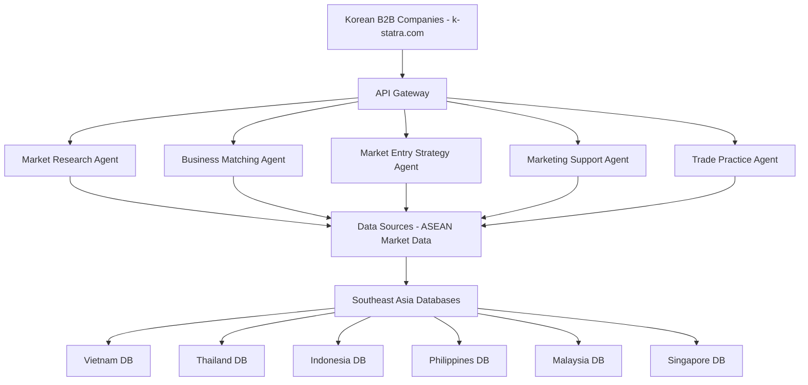

# Southeast Asia Expert AI Agent - Architecture

## System Architecture



## Module Breakdown

### 1. Market Research & Analysis
- Local industry trends analysis
- Competitor landscape mapping
- Target customer segmentation
- Market size and growth projections

### 2. Business Matching
- Buyer discovery and profiling
- Networking support contacts
- Match scoring algorithm
- Cultural compatibility assessment

### 3. Market Entry Strategy
- Regulatory compliance requirements
- Tariff and duty calculations
- Certification requirements
- Customized market entry roadmaps

### 4. Local Marketing Support
- Exhibition and trade show recommendations
- Sample testing logistics
- Distribution network mapping
- Localized marketing campaign strategies

### 5. Trade Practice Support
- Contract template review
- Logistics options (L/C, T/T, door-to-door)
- Payment method consulting
- Export documentation support

## Data Flow

```
User Query -> API Gateway -> Agent Selection -> Knowledge Base Retrieval -> AI Processing -> Response Generation -> API Response
```

## Key Countries Covered

- Vietnam
- Thailand
- Indonesia
- Philippines
- Malaysia
- Singapore
